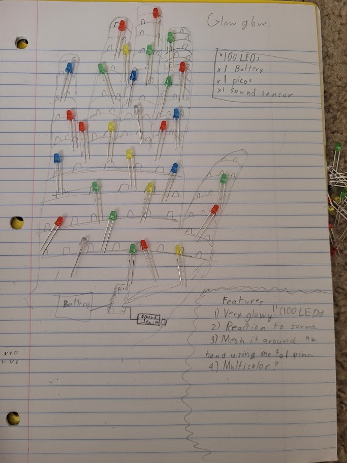

# GlowGlove

I saw lots of people make cool LED projects and so I also decided that I was going to try to make one. This is basically just a matrix of 100 LEDs that I will form around my hand so that it is all glowy. The main problem is going to be wiring them, because I want all of the connections to be flexible, and I also want to be able to control the LED's seperately, so I was going to use a mesh, so that I can just cycle through 10 at a time, and so I can have individual control over each LED. I was thnking that I could do something interesting with this and the Sound sensor.
