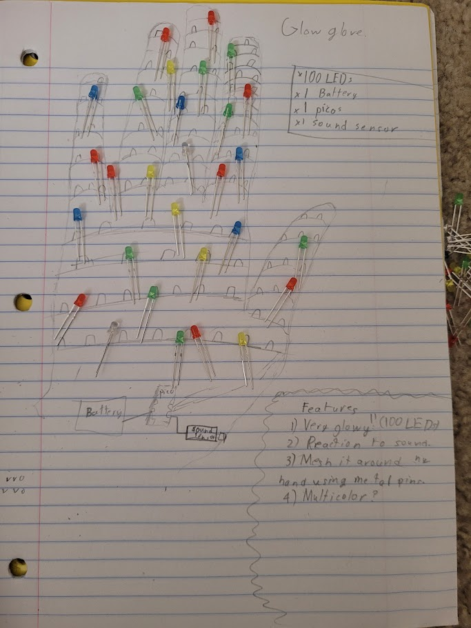

# GlowGlove

I saw lots of people make cool LED projects and so I also decided that I was going to try to make one. This is basically just a matrix of 100 LEDs that I will form around my hand so that it is all glowy. The main problem is going to be wiring them, because I want all of the connections to be flexible, and I also want to be able to control the LED's seperately, so I was going to use a mesh, so that I can just cycle through 10 at a time, and so I can have individual control over each LED. I was thnking that I could do something interesting with this and, basically jsut be glowy and look cool.
One important thing that I learned was that you can only have 2 LEDs in series then you have to solder these together in parrallel. Then I just connected 5 of these together in parralel in order to maker the light for 1 "finger". Then I connected two of the fingers together on the positive to suuply 5V to both of them, and then linked up all of the fingers together with ground. The hardest part was soldering on joint at a time, then bending and reshaping it to fit around each individual curve. Now it holds it's shape without any additional support, so I feel like it was pretty successful.
